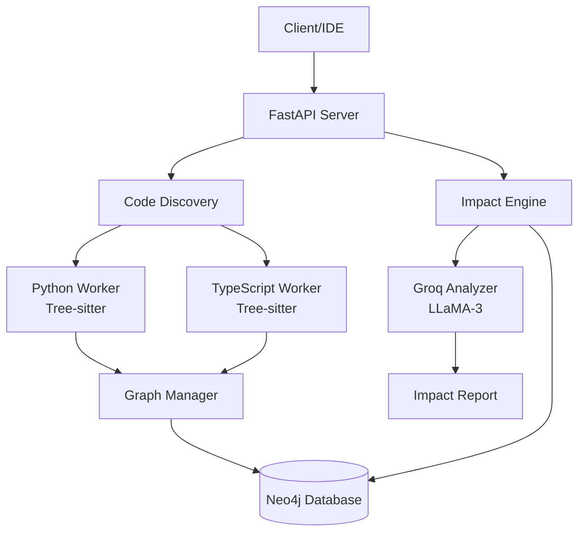

# Nexus AI Engine

**Real-time Code Impact Analysis powered by Knowledge Graphs and AI**

Nexus AI Engine is an intelligent code analysis system that automatically detects architectural drift and analyzes the downstream impact of code changes. By combining Neo4j graph database with AI-powered reasoning (via Groq), it provides developers with instant feedback on how their changes affect the broader codebase.

## 🎯 Key Features

- **📊 Knowledge Graph Construction** - Automatically builds a comprehensive dependency graph from your codebase using Neo4j
- **🔍 Impact Analysis** - Identifies all downstream dependencies affected by code changes at the symbol level
- **🤖 AI-Powered Reasoning** - Uses LLaMA-3 via Groq to provide intelligent impact assessments and recommendations
- **🌐 Multi-Project Support** - Manage and analyze multiple projects simultaneously with isolated graph data
- **🔗 Cross-Language Detection** - Detects dependencies across Python and TypeScript (extensible to other languages)
- **📈 Graph Visualization** - Interactive visualization of code dependencies and relationships
- **⚡ Real-time Updates** - Incrementally updates the graph when files change

## 🚀 Quick Start

### Prerequisites

- Python 3.10 or higher
- Neo4j database (local or cloud)
- Groq API key ([Get one here](https://console.groq.com))

### Installation

1. **Clone the repository**
   ```bash
   git clone <repository-url>
   cd "New folder"
   ```

2. **Install dependencies**
   ```bash
   pip install -r requirements.txt
   ```

3. **Configure environment variables**
   
   Copy `.env.example` to `.env` and fill in your credentials:
   ```bash
   cp .env.example .env
   ```
   
   Edit `.env`:
   ```env
   NEO4J_URI=bolt://localhost:7687
   NEO4J_USER=neo4j
   NEO4J_PASSWORD=your_password
   GROQ_API_KEY=your_groq_api_key
   PYTHON_WORKER_URL=http://localhost:8001
   TYPESCRIPT_WORKER_URL=http://localhost:8002
   ```

4. **Start the API server**
   ```bash
   python src/api_server.py
   ```
   
   The server will start on `http://localhost:8000` and automatically launch language worker processes.

### Basic Usage

**Initialize a local project:**
```bash
curl -X POST http://localhost:8000/initialize-graph \
  -H "Content-Type: application/json" \
  -d '{
    "project_id": "my-project",
    "project_path": "path/to/your/project"
  }'
```

**Check impact of a file change:**
```bash
curl -X POST http://localhost:8000/check-impact \
  -H "Content-Type: application/json" \
  -d '{
    "project_id": "my-project",
    "filename": "src/utils/helper.py",
    "changes": "Modified function signature"
  }'
```

**Visualize the dependency graph:**

Open `graph_visualization.html` in your browser and it will fetch data from `http://localhost:8000/graph-data?project_id=my-project`

**Visual Example:**


*Interactive dependency graph showing code relationships and impact analysis*

## 📐 Architecture Overview



### Core Components

- **API Server** - FastAPI-based REST API with automatic worker lifecycle management
- **Code Discovery** - Scans projects and delegates parsing to language-specific workers
- **Language Workers** - Tree-sitter based parsers for Python and TypeScript
- **Graph Manager** - Manages Neo4j operations and relationship creation
- **Impact Engine** - Traverses the dependency graph to find affected code
- **Groq Analyzer** - AI-powered impact reasoning and recommendation generation

## 📚 Documentation

- **[ARCHITECTURE.md](ARCHITECTURE.md)** - Detailed system architecture and design decisions
- **[API_REFERENCE.md](API_REFERENCE.md)** - Complete API endpoint documentation
- **[SETUP.md](SETUP.md)** - Detailed installation and configuration guide
- **[DEVELOPER_GUIDE.md](DEVELOPER_GUIDE.md)** - Guide for contributors and extending the system
- **[USAGE_EXAMPLES.md](USAGE_EXAMPLES.md)** - Practical examples and common workflows
- **[AI_TOOLS.md](AI_TOOLS.md)** - AI tools and models used in development


## 🔌 API Endpoints

| Endpoint | Method | Description |
|----------|--------|-------------|
| `/add-repository` | POST | Clone and index a GitHub repository |
| `/initialize-graph` | POST | Scan local project and build knowledge graph |
| `/check-impact` | POST | Analyze impact of file changes |
| `/graph-data` | GET | Retrieve graph visualization data |
| `/clear-graph` | DELETE | Clear project graph data |

See [API_REFERENCE.md](API_REFERENCE.md) for detailed endpoint documentation.

## 🎯 Use Cases

- **Pre-commit Impact Analysis** - Understand the blast radius before committing changes
- **Architectural Drift Detection** - Identify when code changes violate architectural patterns
- **Refactoring Safety** - Safely refactor shared utilities by knowing all dependents
- **Code Review Enhancement** - Provide reviewers with automatic impact analysis
- **Dependency Visualization** - Understand complex codebases through interactive graphs

## 🛠️ Technology Stack

- **Backend**: Python 3.10+, FastAPI
- **Database**: Neo4j (Graph Database)
- **AI/LLM**: Groq (LLaMA-3.3-70B)
- **Code Parsing**: Tree-sitter (Python & TypeScript grammars)
- **Validation**: Pydantic v2
- **Visualization**: Vis.js (graph rendering)

## 📊 Project Status

**Current Capabilities:**
- ✅ Python and TypeScript parsing
- ✅ Multi-project support with data isolation
- ✅ Symbol-level dependency tracking
- ✅ Cross-language API contract stitching
- ✅ AI-powered impact analysis
- ✅ Graph visualization
- ✅ Windows and Unix path compatibility

**Known Limitations:**
- No authentication/authorization
- Limited to Python and TypeScript (extensible)
- Requires manual re-indexing after changes (no file watching)
- No automated testing suite

## 🤝 Contributing

See [DEVELOPER_GUIDE.md](DEVELOPER_GUIDE.md) for information on:
- Setting up a development environment
- Adding support for new languages
- Extending the graph schema
- Code style guidelines

## 📝 License

[Add your license information here]

## 🙏 Acknowledgments

- Built with [Tree-sitter](https://tree-sitter.github.io/) for robust code parsing
- Powered by [Groq](https://groq.com/) for fast LLM inference
- Graph database by [Neo4j](https://neo4j.com/)
