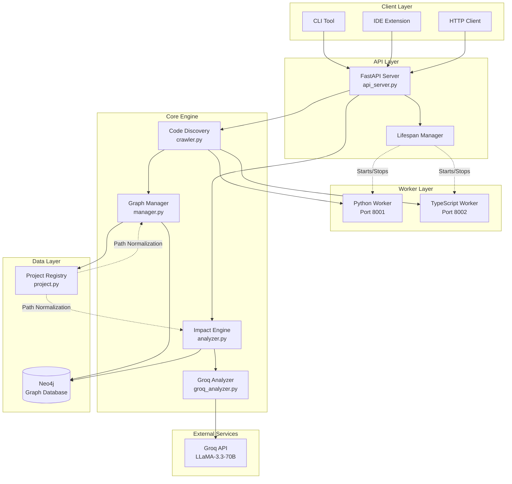
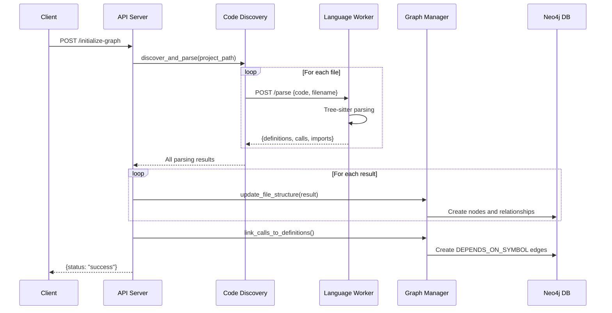
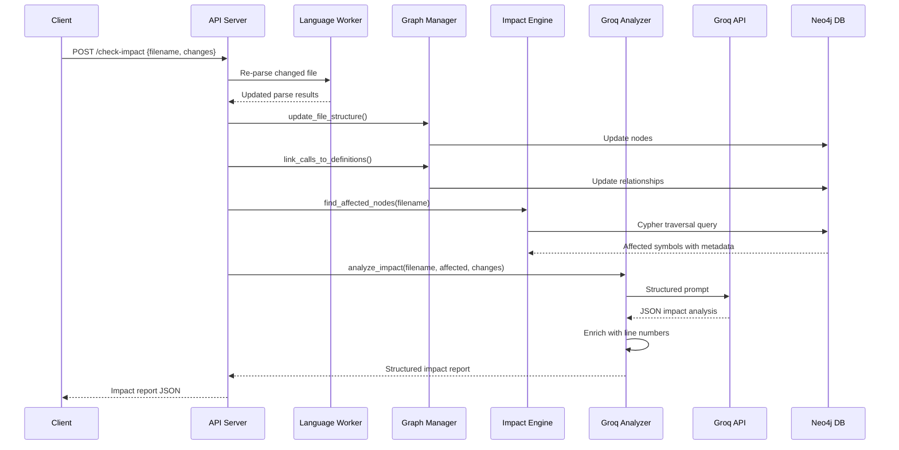
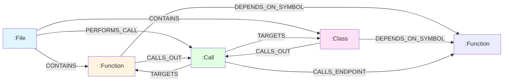

# System Architecture

This document provides a detailed overview of the Nexus AI Engine's architecture, design decisions, and component interactions.

## Table of Contents

- [High-Level Architecture](#high-level-architecture)
- [Core Components](#core-components)
- [Data Flow](#data-flow)
- [Graph Schema](#graph-schema)
- [Design Decisions](#design-decisions)

## High-Level Architecture



## Core Components

### 1. API Server (`src/api_server.py`)

**Purpose**: Main entry point for all client interactions. Provides RESTful API endpoints and manages worker lifecycle.

**Key Responsibilities**:
- Expose HTTP endpoints for graph operations
- Manage Python and TypeScript worker processes via lifespan events
- Handle multi-project routing and isolation
- Coordinate between discovery, graph management, and impact analysis

**Technology**: FastAPI with async support

**Worker Lifecycle Management**:
```python
@asynccontextmanager
async def lifespan(app: FastAPI):
    # Startup: Launch worker subprocesses
    workers.append(subprocess.Popen([sys.executable, "src/workers/python/main.py"]))
    workers.append(subprocess.Popen([sys.executable, "src/workers/typescript/main.py"]))
    yield
    # Shutdown: Terminate workers gracefully
    for worker in workers:
        worker.terminate()
```

### 2. Code Discovery (`src/discovery/crawler.py`)

**Purpose**: Scans project directories and delegates file parsing to appropriate language workers.

**Key Responsibilities**:
- Recursively traverse project directories
- Filter files by extension (`.py`, `.ts`, `.js`)
- Exclude virtual environments and hidden folders
- Send files to language-specific workers via HTTP
- Aggregate parsing results

**File Discovery Pattern**:
```python
ext_to_worker = {
    ".py": "python",
    ".ts": "typescript",
    ".js": "typescript"
}
```

### 3. Language Workers

#### Python Worker (`src/workers/python/`)

**Components**:
- `main.py` - FastAPI server on port 8001
- `parser.py` - Tree-sitter based Python parser

**Parsing Strategy**:
- Uses `tree-sitter-python` grammar
- Extracts: function definitions, class definitions, function calls, imports
- Tracks parent symbols for call attribution
- Returns line numbers for all extracted elements

**Example Output**:
```json
{
  "definitions": [
    {"type": "function", "name": "authenticate_user", "line": 15}
  ],
  "calls": [
    {"name": "validate_token", "parent": "authenticate_user", "line": 18}
  ],
  "imports": [
    {"content": "from jwt import decode", "line": 1}
  ]
}
```

#### TypeScript Worker (`src/workers/typescript/`)

**Components**:
- `main.py` - FastAPI server on port 8002
- `parser.py` - Tree-sitter based TypeScript parser

**Parsing Strategy**:
- Uses `tree-sitter-typescript` grammar
- Extracts: function declarations, arrow functions, class methods, API calls
- Detects HTTP method calls (`fetch`, `post`, `get`, etc.)

### 4. Graph Manager (`src/graph/manager.py`)

**Purpose**: Manages all Neo4j database operations and relationship creation.

**Key Responsibilities**:
- Create and update graph nodes (File, Function, Class, Call)
- Establish relationships between nodes
- Implement generic API contract stitching
- Provide graph data for visualization
- Support multi-project data isolation

**Node Creation Strategy**:
```cypher
MERGE (d:Function {name: $name, filename: $filename, project_id: $project_id})
SET d.line = $line
WITH d
MATCH (f:File {name: $filename, project_id: $project_id})
MERGE (f)-[:CONTAINS]->(d)
```

**Relationship Types**:
- `CONTAINS` - File contains Function/Class
- `PERFORMS_CALL` - File performs Call
- `CALLS_OUT` - Function/Class calls out to Call node
- `TARGETS` - Call targets a Function/Class definition
- `DEPENDS_ON_SYMBOL` - High-level dependency relationship (used for impact analysis)
- `CALLS_ENDPOINT` - Cross-language API contract link

### 5. Impact Engine (`src/engine/analyzer.py`)

**Purpose**: Traverses the dependency graph to identify code affected by changes.

**Key Responsibilities**:
- Find all symbols defined in a changed file
- Traverse `DEPENDS_ON_SYMBOL` relationships
- Collect affected files, symbols, and line numbers
- Return structured impact data

**Traversal Query**:
```cypher
// Find ALL Functions/Classes in the changed file
MATCH (target {filename: $filename, project_id: $project_id})
WHERE target:Function OR target:Class

// Find who depends on these targets
MATCH (caller {project_id: $project_id})-[:DEPENDS_ON_SYMBOL]->(target)

// Get the file containing the caller
MATCH (caller_file:File {project_id: $project_id})-[:CONTAINS]->(caller)

RETURN DISTINCT 
    caller_file.name as affected_file, 
    caller.name as affected_symbol,
    caller.line as affected_line,
    target.name as dependency_name
```

### 6. Groq Analyzer (`src/engine/groq_analyzer.py`)

**Purpose**: Uses LLM to provide intelligent impact analysis and recommendations.

**Key Responsibilities**:
- Generate structured prompts with change context
- Call Groq API (LLaMA-3.3-70B model)
- Parse JSON responses from LLM
- Enrich responses with actual line numbers from Neo4j
- Handle parsing errors gracefully

**Prompt Engineering Strategy**:
- Provide change description and code context
- Include affected dependencies from graph traversal
- Request structured JSON output
- Ask for impact level, reasoning, and recommendations

**Response Format**:
```json
{
  "impact_level": "high|medium|low|none",
  "summary": "Brief summary",
  "changed_file": "path/to/file.py",
  "affected_items": [
    {
      "file": "path/to/dependent.py",
      "symbol": "function_name",
      "symbol_type": "function",
      "line_number": 42,
      "depends_on": "changed_function",
      "impact_reason": "Specific explanation",
      "breaking": true
    }
  ],
  "recommendations": ["Action 1", "Action 2"]
}
```

### 7. Project Registry (`src/models/project.py`)

**Purpose**: Manages multiple projects and provides path normalization.

**Key Responsibilities**:
- Register and track multiple projects
- Provide project-specific path normalizers
- Ensure data isolation between projects
- Handle Windows/Unix path compatibility

**Path Normalization**:
- Converts absolute paths to relative paths from project root
- Normalizes path separators (Windows `\` vs Unix `/`)
- Ensures consistent path representation in the graph

## Data Flow

### 1. Project Initialization Flow



### 2. Impact Analysis Flow



## Graph Schema

### Node Types

#### File Node
```
:File {
  name: String (relative path),
  project_id: String
}
```

#### Function Node
```
:Function {
  name: String,
  filename: String,
  line: Integer,
  project_id: String
}
```

#### Class Node
```
:Class {
  name: String,
  filename: String,
  line: Integer,
  project_id: String
}
```

#### Call Node
```
:Call {
  name: String,
  filename: String,
  line: Integer,
  parent: String (optional),
  project_id: String
}
```

### Relationship Types



### Example Graph Structure

For this code:
```python
# auth.py
def authenticate_user(token):
    return validate_token(token)

# api.py
from auth import authenticate_user

def login_endpoint(request):
    user = authenticate_user(request.token)
    return user
```

The graph would be:
```
(:File {name: "auth.py"})
  -[:CONTAINS]->(:Function {name: "authenticate_user", line: 2})
  -[:CALLS_OUT]->(:Call {name: "validate_token", line: 3, parent: "authenticate_user"})

(:File {name: "api.py"})
  -[:CONTAINS]->(:Function {name: "login_endpoint", line: 5})
  -[:CALLS_OUT]->(:Call {name: "authenticate_user", line: 6, parent: "login_endpoint"})
    -[:TARGETS]->(:Function {name: "authenticate_user"})

(:Function {name: "login_endpoint"})
  -[:DEPENDS_ON_SYMBOL]->(:Function {name: "authenticate_user"})
```

## Design Decisions

### 1. Why Neo4j?

**Decision**: Use Neo4j graph database instead of relational database.

**Rationale**:
- **Natural representation**: Code dependencies are inherently graph-structured
- **Efficient traversal**: Cypher queries for multi-hop dependency traversal are more efficient than recursive SQL
- **Flexible schema**: Easy to add new node types and relationships without migrations
- **Visualization**: Native graph structure makes visualization straightforward

### 2. Why Separate Language Workers?

**Decision**: Run language parsers as separate HTTP services instead of in-process.

**Rationale**:
- **Isolation**: Parser crashes don't affect the main API server
- **Scalability**: Workers can be scaled independently
- **Language flexibility**: Easy to add workers in different languages (e.g., Go worker for Go parsing)
- **Development**: Workers can be developed and tested independently

### 3. Why Tree-sitter?

**Decision**: Use Tree-sitter for code parsing instead of AST libraries.

**Rationale**:
- **Error tolerance**: Tree-sitter handles syntax errors gracefully
- **Performance**: Incremental parsing for large files
- **Multi-language**: Consistent API across all languages
- **Accuracy**: Produces concrete syntax trees with precise location information

### 4. Symbol-Level vs File-Level Tracking

**Decision**: Track dependencies at the symbol (function/class) level, not just file level.

**Rationale**:
- **Precision**: More accurate impact analysis
- **Granularity**: Can identify exactly which functions are affected
- **Refactoring support**: Handles function renames and moves
- **Better AI context**: LLM gets specific symbol information for better reasoning

### 5. Two-Phase Relationship Creation

**Decision**: Create `DEPENDS_ON_SYMBOL` relationships in a separate phase after initial graph creation.

**Rationale**:
- **Correctness**: All definitions must exist before linking calls
- **Cross-file dependencies**: Calls may reference definitions in other files
- **Simplicity**: Cleaner separation of concerns

### 6. Generic API Contract Stitching

**Decision**: Use heuristic-based API contract detection instead of explicit annotations.

**Rationale**:
- **Zero configuration**: Works without developer annotations
- **Language agnostic**: Same approach works for any language
- **Pragmatic**: Covers common patterns (REST endpoints with CRUD naming)
- **Extensible**: Can be enhanced with more sophisticated detection

**Trade-off**: May create false positives, but better than missing cross-language dependencies.

### 7. Multi-Project Isolation via `project_id`

**Decision**: Use `project_id` property on all nodes instead of separate databases.

**Rationale**:
- **Simplicity**: Single database instance
- **Cost**: No need for multiple Neo4j instances
- **Flexibility**: Easy to query across projects if needed
- **Performance**: Indexed `project_id` provides efficient filtering

### 8. Path Normalization Strategy

**Decision**: Store relative paths with forward slashes in the graph, normalize at query time.

**Rationale**:
- **Cross-platform**: Works on Windows and Unix
- **Consistency**: Graph always has consistent path format
- **Portability**: Projects can be moved between OS without re-indexing
- **Simplicity**: Normalization logic centralized in `PathNormalizer`

### 9. LLM Integration for Impact Analysis

**Decision**: Use LLM (Groq/LLaMA-3) for impact reasoning instead of rule-based analysis.

**Rationale**:
- **Context awareness**: LLM understands code semantics, not just structure
- **Natural language output**: Generates human-readable explanations
- **Flexibility**: Adapts to different types of changes without hardcoded rules
- **Recommendations**: Can suggest specific actions based on change type

**Trade-off**: Requires API key and external dependency, but provides significantly better insights.

### 10. Incremental Updates

**Decision**: Support incremental graph updates instead of full re-indexing.

**Rationale**:
- **Performance**: Faster for single file changes
- **Real-time**: Enables near-instant impact analysis
- **Scalability**: Works for large codebases

**Implementation**: Re-parse changed file, update its nodes, re-link relationships.

## Performance Considerations

### Graph Query Optimization

- All nodes have `project_id` indexed for fast filtering
- `DEPENDS_ON_SYMBOL` relationships enable single-hop impact queries
- Limit traversal depth to prevent runaway queries (currently 100 results max)

### Worker Communication

- HTTP-based worker communication adds latency but provides isolation
- Consider gRPC for production deployments with high throughput needs

### Neo4j Configuration

- Recommended: Use Neo4j with sufficient heap memory (4GB+ for large projects)
- Enable query logging to identify slow Cypher queries
- Consider read replicas for read-heavy workloads

## Future Enhancements

- **File watching**: Automatic re-indexing on file changes
- **Incremental parsing**: Only re-parse changed functions, not entire files
- **Caching**: Cache LLM responses for identical change patterns
- **Batch processing**: Analyze multiple file changes in a single request
- **Advanced stitching**: Use LLM to detect API contracts instead of heuristics
- **Test coverage integration**: Show which tests cover affected code
